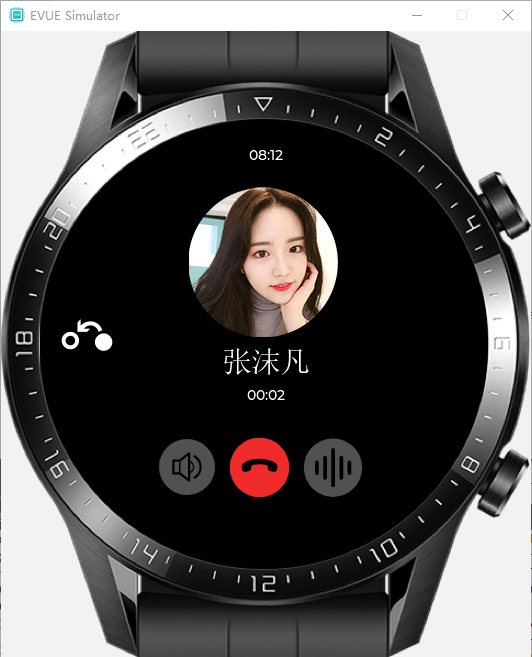

一、EVUE简介
========================================

+ EVM GIthub 地址： https://github.com/scriptiot/evm
+ EVM Gitee  地址： https://gitee.com/scriptiot/evm
+ EVUE GIthub 地址： https://github.com/scriptiot/evue
+ EVUE Gitee  地址： https://gitee.com/scriptiot/evue

## 1.  EVUE是什么

 **`EVUE`** 全称 `Embedded Vue`，是基于[`EVM`](https://github.com/scriptiot/evm)构建的一套面向物联网小程序开发框架，类似VUE的开发方式，全面兼容鸿蒙HML语法，极速提升开发效率。

## 2. EVUE设计初衷

**EVM**诞生以来，一直致力于让物联网开发变得简单，自鸿蒙OS 1.0 发布后，最引人注目的莫过于华为在应用程序开发框架层面面向应用开发者提供了一种全新的开发方式：

> **框架层**
> - 对于HarmonyOS应用，框架层提供了Java/C/C++/JS等多语言的用户程序框架和[Ability](https://developer.harmonyos.com/cn/docs/documentation/doc-guides/glossary-0000000000029587#ZH-CN_TOPIC_0000001050749051__li1373094219463)框架，两种UI框架（包括适用于Java语言的Java UI框架、适用于JS语言的JS UI框架），以及各种软硬件服务对外开放的多语言框架API。
> - 对于采用HarmonyOS的设备，框架层提供了C/C++/JS等多语言的框架API。不同设备支持的API与系统的组件化裁剪程度相关。

**针对物联网开发场景，鸿蒙OS官方给出的答案是基于javascript开发物联网APP,  官方推出了一套针对轻量级智能穿戴开发的解决方案： HML + JS + MVVM = 物联网小程序**

**EVM**团队在深入研究鸿蒙源码后，惊奇的发现，华为面向物联网场景希望构建一套基于js语言的应用生态体系的想法与EVM的初衷不谋而合，可谓英雄所见略同；惊叹之余，纵观整个IT行业的发展，从PC互联网到移动互联网再到现在的物联网，技术发展日新月异，脚本语言的崛起本质上是提供了一种高效的开发方式，极大促进生产力的提高，人工智能时代Python语言的崛起也是如此，因此，我们有理由相信未来物联网的主流开发方式肯定是js和python语言，但目前来看，js语言已经事实上被大厂选择，未来物联网的生态很有可能基于js构建。下面简单介绍一下**EVM**在物联网的定位：

为此，EVM团队决定移植鸿蒙的整个轻量级智能穿戴框架到EVM的生态中，同时也回馈鸿蒙社区，助力鸿蒙社区的健康成长，让鸿蒙的造福更多的开发者，加速**物联网小程序**的生态建设；

本质上，**EVM + HML + CSS + JS +  LVGL**  = **EVUE** ( Embedded  Vue 类web开发框架vue的物联网应用开发框架 )，**EVM**团队参考鸿蒙的轻量级智能穿戴框架实现了一套类似的物联网小程序开发框架**EVUE**,  基于**EVM**的**EVUE**相比鸿蒙OS的JS FA框架拥有更友好的生态支持，可以快速适配更多的芯片和开发板，让更多的开发者可以更加简单的体验鸿蒙的开发方式，学习鸿蒙的核心理念，更重要的是无缝对接前端开发生态，让web工程师也可以无缝的开发物联网应用，极大的提升开发效率；

## 3. EVUE优势特点

- 物联网小程序开发
- 类VUE应用框架
- 轻量级智能穿戴应用开发
- 全面兼容鸿蒙OS HML语法
- PC模拟器支持，PC端开发，设备端运行

## 4. 目录结构

| 文件      |    说明|
| :-------- | --------:|
| **bin**| 二进制目录 |
| **bin/x86_64-linux-gnu/**| linux平台evue二进制程序 |
| **bin/x86_64-window-mingw/**| windows平台evue二进制程序 |
| **frameworks**| js app框架 |
| **include**|   evm头文件  |
| **lib**|  静态库目录 |
| **lib/x86_64-linux-gnu/libhml.a**|   linux下hml静态库 |
| **lib/x86_64-window-mingw/libhml.a**|  windows下hml静态库|
| **lvgl**| lvgl 7.6.1 版本源码|
| **modules**| 库目录 |
| **modules/ecma**| ecma标准库 |
| **modules/hml**| 基于lvgl的hml封装 |
| **src**| 工程源码目录 |
| **test**| 测试代码目录 |

二、基于EVUE的智能穿戴应用展示
========================================

## 1. 启动页面

## 2. 首页

## 3. 电话

## 4. 运动曲线

## 5. 音乐应用

## 6. 天气应用

## 7. 运动记录

## 8. 更新

三、加入EVM
========================================

技术创造未来，**EVM**团队需要你的参与，**EVM**团队现面向社区招募有激情有梦想的社区开发者，共同开创物联网新生态；
无论你的技术背景如何，你都可以为EVM的成长贡献一份微薄之力，**EVM**团队欢迎你！

## 1. EVM生态开发者联盟

`EVM生态开发者联盟`是EVM团队面向社区成立的深度开发者爱好群，在这里你可以：

+ 随时掌握EVM的最新技术动态，学习物联网最高效的开发方式
+ 参与EVM未来战略的制定和未来的发展路线规划
+ 享受EVM团队零距离接触，欢迎加入EVM团队共创未来
+ 享受EVM企业版无偿技术支持，多种技术解决方案自由分享

> 如果群二维码失效，请加微信号dragondjf，备注：`张三--虚拟机爱好者--武汉`， 第一时间会拉你入群，谢谢！

## 2. EVM人才需求

EVM处于创业高速成长期，欢迎有志之士加入，共同开辟物联网新生态！

+ 如果你对虚拟机技术或是如何实现一门语言感兴趣，我们欢迎你；
+ 如果你对js、python和c语言都拥有深度的理解和应用，我们欢迎你；
+ 如果你对RTOS都拥有深度的理解和应用, 深度研究过一个或多个RTOS核心源码的高级C语言开发者，我们欢迎你；
+ 如果你精通各种物联网协议和驱动移植，我们欢迎你；

坐标地点：武汉，英雄辈出的城市！

感兴趣的朋友可以发送简历到邮箱：scriptiot@aliyun.com， 欢迎你的加入！

## 3. EVM官方QQ交流群

> 群号：`399011436`

## 4. 关注EVM公众号

> 公众号名称： `EVM字节码`

## 5. 联系我们

+ 论坛： [EVM官方技术交流论坛](http://forum.evmiot.com/)
+ 邮箱： scriptiot@aliyun.com

欢迎大家通过 `GitHub issues`、`邮件` `论坛` 或 `QQ群`反馈问题和联系我们。
